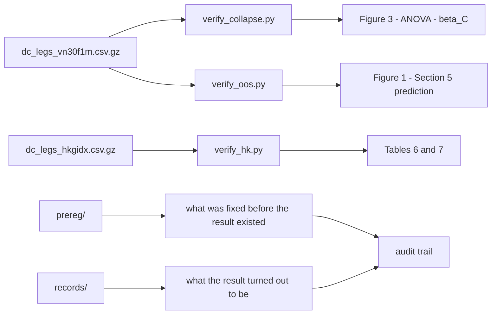

# The Overshoot Deficit


[](https://doi.org/10.5281/zenodo.22227011)

Replication package for **"The Overshoot Deficit: A Cross-Market Conditional Scaling Relation in
Directional Change"** — Son Do, Noralabs, Vietnam.

This repository lets you check the paper's central claim in a couple of seconds.

> The Glattfelder–Dupuis–Olsen relation ⟨ω⟩ ≈ δ is **not unconditional**. Index directional-change
> legs by the threshold's size against the session's realised range, δ/R, and the overshoot ratio
> ω/δ runs from **1.342 to 0.492**, crossing unity near **δ ≈ 20% of daily range**. Threshold
> identity carries no detectable effect once that ratio is controlled.

That claim is either in the data or it is not, so the data is here.

## At a glance

| | |
|---|---|
| **What the paper argues** | A widely cited scaling regularity is conditional, and the variable it is conditional on is not the threshold |
| **What indexes it** | δ measured against the session's realised range — not θ, not time scale, not scale-dependent memory |
| **Headline numbers** | ω/δ from 1.342 to 0.492 · unity crossing ≈ 0.20 · compression slope β_C = −1.768 |
| **Fastest check** | `python verify/verify_collapse.py`, about two seconds |
| **Replicated on** | A Hong Kong index feed, pre-registered, run once, on data withheld from every earlier inspection |
| **What failed** | The mechanism we proposed for it, and the control rule we built from it. Both are reported |
| **Audit trail** | 9 pre-registrations · 12 result and audit records · 21 OpenTimestamps proofs |

## Quick start

```bash
pip install -r requirements.txt

python verify/verify_collapse.py     # the collapse, and the pre-registered criteria
python verify/verify_oos.py          # Figure 1, and the withheld-window prediction
python verify/verify_hk.py           # the external replication on a second market
```

Three commands, about six seconds together, no download and no private data. Together they rebuild
every claim the paper makes about the scaling relation itself.

## Core findings

| | VN30F1M (discovery) | HKG.IDX/HKD (replication) | verdict |
|---|---:|---:|---|
| Compression slope β_C | −1.768 | −1.372 to −1.534 | **replicates** |
| Unity crossing, δ/R | ≈ 0.20 | 0.210 – 0.226 | **replicates** |
| Band effect | F(5,17) = 45.13, p = 3.2e−09 | F(5,10) to F(5,13) = 37.7 – 244.8 | **replicates** |
| Threshold effect once conditioned | p_θ = 0.118, SS ratio 0.046 | detectable, SS ratio 0.036 – 0.114 | **mostly absorbed** |
| Self-inclusion of ω in R | survives both pre-registered tests | — | **not an artefact** |
| Mechanism: compression should strengthen as the window narrows | proposed | **fails**, and the failure replicates | **rejected** |

The Hong Kong figures are the never-inspected holdout, not the full sample. The mechanism row is the
one we most wanted to be true.

## The collapsed curve

Six thresholds spanning a twentyfold range of θ, plotted against δ/R, land on one curve:

| δ/R band | ω/δ | what it means |
|---|---:|---|
| 0.05 – 0.10 | 1.342 | overshoot exceeds the threshold — momentum is paid |
| 0.10 – 0.15 | 1.243 | momentum |
| 0.15 – 0.22 | 1.048 | momentum, barely |
| 0.22 – 0.32 | 0.929 | overshoot falls short — the fade is paid |
| 0.32 – 0.45 | 0.740 | fade |
| 0.45 – 0.65 | 0.492 | fade |

Unity is where the overshoot-deficit term changes sign, which is why the crossing is the number that
travels across markets.

## What you can reproduce here

| target | script | from shipped files alone? | time |
|---|---|---|---|
| Figure 3, the two-way analysis, the five pre-registered criteria | `verify/verify_collapse.py` | **yes** | ~2s |
| Figure 1, and Section 5's withheld-window test | `verify/verify_oos.py` | **yes** | ~2s |
| Tables 6 and 7, the Hong Kong replication | `verify/verify_hk.py` | **yes** | ~2s |
| The Hong Kong analysis from raw quotes | `src/dl_hk.py` → `src/hk_pipeline_english.py` | **yes** | ~29h, download-bound |
| The Hong Kong extract, rebuilt | `src/build_hk_extract.py` | needs the archive | minutes |
| Everything economic: Tables 1–5, A1–A3, Figure 4 | — | **no** — published as frozen aggregates in `data/economics.json` | — |
| The notebook, E1/E2/E3, the two denominator tests, the validation suite | `src/` | **no** — need the VN30F1M tick panel | — |

Scripts that cannot run here say so and explain why, rather than failing with a traceback. They ship
because the method should be readable line by line; what they produced is in `records/`.

## Replication flow



## Repository map

| path | contents |
|---|---|
| `data/dc_legs_vn30f1m.csv.gz` | 745,658 legs over 1,339 sessions — **dimensionless ratios only** |
| `data/dc_legs_hkgidx.csv.gz` | 1,872,350 Hong Kong legs at all three pre-registered window levels |
| `data/economics.json` | frozen aggregate profit results: constructions, walk-forward folds, cost grid, threshold-control arms, out-of-sample equity |
| `verify/` | the three verification scripts above |
| `src/` | directional-change kernels, the shared collapse pipeline, one script per experiment |
| `prereg/` | nine pre-registrations and their proofs — see `prereg/README.md` |
| `records/` | twelve results and audits, including the ones that went against us — see `records/README.md` |
| `overshoot_deficit.ipynb` | the analysis notebook, shipped with its outputs; it reads the tick panel and cannot run here |
| `figures/`, `paper/` | the four figures as SVG; the manuscript in HTML and PDF |

## Expected output

`verify/verify_collapse.py` prints the six band means above, then:

```
TWO-WAY ANOVA on 28 cell means
  band | theta   F(5,17) =   45.13   p = 3.19e-09
  theta | band   F(5,17) =    2.08   p = 0.118
  SS_theta / SS_band = 0.046
  compression slope beta_C = -1.768  (SE 0.112, R2 0.984)

PRE-REGISTERED CRITERIA (PREREG section 5.1)
  PASS  p_band < 0.01                          3.2e-09
  PASS  p_theta > 0.05                         0.118
  PASS  SS_theta / SS_band < 0.35              0.046
  PASS  within/between spread < 0.40           0.219
  PASS  monotone decreasing band means         -
```

These are the paper's figures to the digit, on a fresh environment resolving numpy 2.5 and pandas 3.0
— two major versions past what the analysis was written against.

## Verifying a timestamp

Every frozen document carries an OpenTimestamps proof anchoring it in the Bitcoin blockchain. Full
`ots verify` needs a Bitcoin node; without one, `ots info` shows offline what matters — the digest the
proof commits to:

```bash
pip install opentimestamps-client
shasum -a 256 prereg/PREREG_external_test_v0.1.md
ots info prereg/PREREG_external_test_v0.1.md.ots | head -1
```

Both print `2b7760fe043a14f2d91caae4b0944d8fd3386c1a61c9ffd5e6caa3533c397347`. All twenty-one proofs
commit to the bytes shipped beside them. Anchoring into a Bitcoin block completes within hours of
stamping, and `ots upgrade` fetches the attestation for any proof still confirming. To check the
anchoring without a node, upload the `.ots` file and its target to the verifier at
opentimestamps.org.

The proofs establish that a document existed before a block was mined. They do not establish
authorship, correctness, or that no other version was ever stamped — which is why `records/` carries
the inspection ledger and the audits alongside them.

## The Hong Kong replication

Section 8 can be checked two ways, and the cheap one is the default: `verify/verify_hk.py` rebuilds
Tables 6 and 7 — every leg count, cell count, F statistic, unity crossing and compression slope, for
the never-inspected holdout and for the full sample — from the shipped extract, with no download.
What it does not re-derive is leg construction itself; the extract begins where the one-second grid
ends.

To check that step too, rebuild from the quotes. Dukascopy's HKG.IDX/HKD feed is free and public, so
nothing here is withheld — only the acquisition is slow.

```bash
pip install -r requirements-full.txt
python src/dl_hk.py                    # 34,440 hourly files, about 400 MB
python src/hk_pipeline_english.py
```

The acquisition took **28.6 hours** at the rate the datafeed serves, and roughly a third of the files
come back empty because the instrument does not quote in those hours. The downloader caches on disk
and writes a placeholder for a missing hour, so it can be interrupted and resumed.

`src/hk_pipeline.py` is the byte-exact artifact that was hashed and timestamped before the test was
run, and its comments and printed output are in the author's working language.
`src/hk_pipeline_english.py` is a reading copy that differs only in language; run over the same
archive, the two produce the same 110 values and the same 20 pass/fail verdicts. See
`records/REPRODUCTION_2026-09-01.md`.

Both files insert `../results_v7` on the import path, a directory that does not exist here. A missing
path entry is skipped and `src/dc_pipeline.py` sits beside the script, so the line is inert; it stays
because removing it from the timestamped original would break the one proof this repository most
needs to hold.

## Why the VN30F1M extract is dimensionless

It reports **δ/R, ω/δ, r/δ** and duration — ratios, not points. It does not report δ, ω, r or the
session range in index points, because δ = θ·P means publishing δ next to θ would reconstruct the
underlying price at every extreme, at roughly one-minute resolution across five and a half years.
That is a derived form of licensed tick data we are not free to redistribute. The ratios reproduce
every claim the paper makes about the scaling relation and reconstruct no price.

That restriction applies to the extract, not to the whole repository: the notebook's stored outputs
and the manuscript both report aggregate statistics in index points — the sample's price range, the
median session range — none of which locates a price in time.

Profit figures cannot be recomputed from ratios, so they are published as frozen aggregates in
`data/economics.json` instead. Every entry is a profit-and-loss difference and none recovers a price
level. Raw VN30F1M tick data is available under a data-access arrangement consistent with the
underlying licence rather than by public download.

**Seven thresholds are released; the paper analyses six.** The analysed set runs from 0.05% to 1%, a
twentyfold span, and contains 263,372 legs. A finer θ = 0.02% is included because it costs nothing to
release and constrains the small-threshold end of Figure 1, but it is outside the analysed grid and
the verification scripts filter it out. Anyone loading the CSV directly must apply the same filter,
`theta >= 5e-4`, or the cell counts will not match. One of the 1,340 sessions produces no completed
leg at any threshold and so does not appear.

### Extract columns

| column | meaning |
|---|---|
| `theta` | directional-change threshold |
| `day` | trading session, YYYYMMDD (VN30F1M) |
| `level` | window definition: `A_full`, `B_day`, `C_sub` (Hong Kong) |
| `win` | trading-window id, used for the held-back split (Hong Kong) |
| `dirn` | +1 if the completed leg was upward |
| `ratio` | δ / realised range — the horizontal axis of Figure 3 |
| `omega_over_delta` | ω / δ — the vertical axis |
| `retrace_over_delta` | r / δ |
| `dur_sec` | leg duration in seconds |

Both extracts store every field at round-trip precision. Prices are discrete, so a handful of legs
land on a bin edge with δ/R exactly 0.10 or 0.45, and at lower precision they cross to the
neighbouring bin — an effect of 0.001 on one band mean, which changes no conclusion, but the released
files should reproduce the paper rather than nearly reproduce it.

## Citation

```
Do, S. (2026). The Overshoot Deficit: A Cross-Market Conditional Scaling Relation in
Directional Change. Working paper. Zenodo. https://doi.org/10.5281/zenodo.22227011
```

The archived snapshot of release `v1.0` carries DOI [10.5281/zenodo.22227011](https://doi.org/10.5281/zenodo.22227011).

## Licence

MIT, in `LICENSE`, covering the code. The released extracts are offered on the same terms: they are
derived quantities, and redistributing them carries no claim over the data they were computed from.
